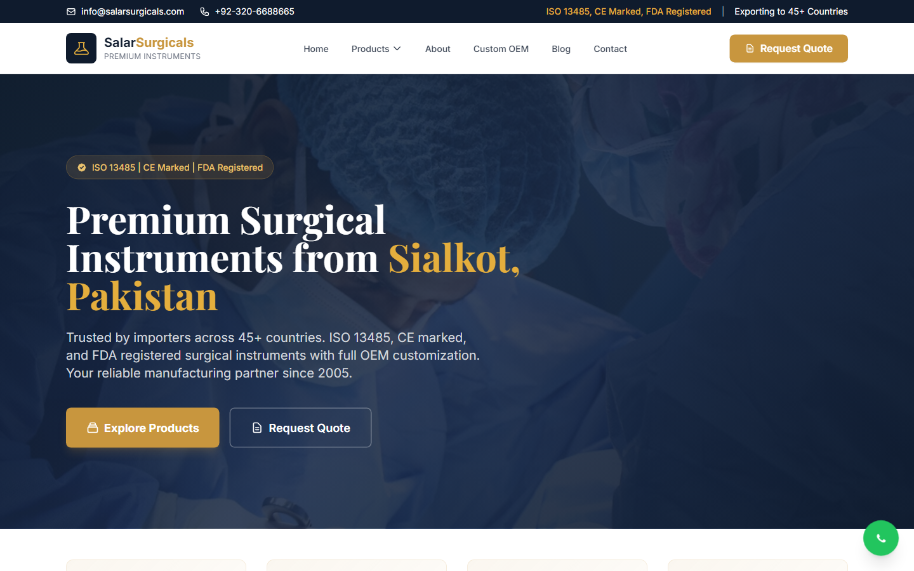
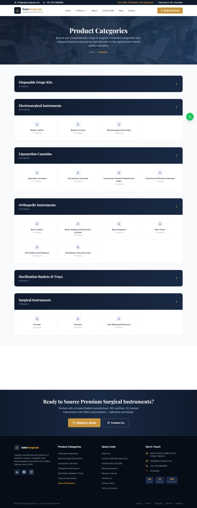
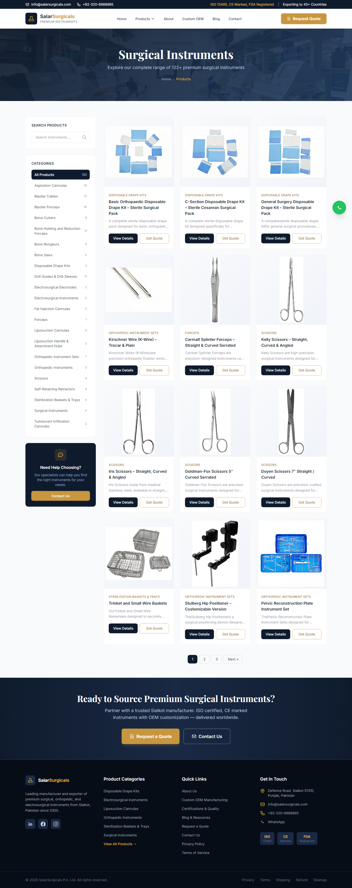
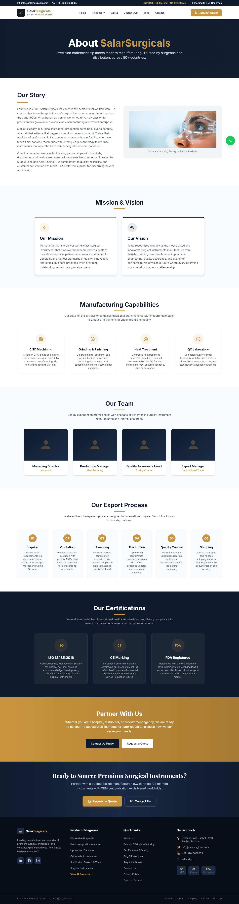
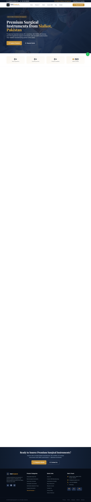

# SalarSurgicals — Premium Surgical Instruments Manufacturer & Exporter

> **Premium surgical, orthopedic, and electrosurgical instruments — manufactured in Sialkot, Pakistan, exported worldwide.**

SalarSurgicals is a manufacturer and exporter of premium surgical instruments based in Sialkot, Pakistan — the world's surgical instrument hub. ISO-certified and CE-marked, we supply distributors and OEM brands across the globe.

---

## Live Website Preview

🌐 **Live site:** [salarsurgicals.com](https://salarsurgicals.com)

### Homepage

*Premium surgical instruments from Sialkot, Pakistan — ISO 13485, CE marked, FDA registered, with full OEM customization.*

### Product Categories

*The complete surgical instrument catalog, organized by category — disposable drape kits, electrosurgical instruments, liposuction cannulas, orthopedic instruments, sterilization baskets & trays, and more.*

### Products

*Browse individual surgical instruments with specifications — manufactured to the highest international quality standards.*

### About

*A trusted Sialkot manufacturer since 2005 — ISO 13485 certified, CE marked, FDA registered, serving 45+ countries.*

📄 View full homepage screenshot

---

## About SalarSurgicals

**SalarSurgicals is a premium surgical instruments manufacturer and exporter.** Manufacturing since 2005, we produce surgical, orthopedic, and electrosurgical instruments to international quality standards and export them to distributors and OEM partners in 45+ countries.

We work with **medical distributors, hospital suppliers, procurement teams, and OEM brands** worldwide.

---

## Our Product Range

A catalog of 500+ premium instruments across major surgical categories:

| Category | Examples |
|----------|----------|
| **General surgical instruments** | Scissors, forceps, needle holders, retractors |
| **Orthopedic instruments** | Bone and joint surgery instrumentation |
| **Electrosurgical instruments** | Instruments for electrosurgical procedures |
| **Custom & OEM instruments** | Built to client specifications and branding |

- **Products:** 500+ instruments
- **Customization:** OEM and custom manufacturing
- **Materials:** premium surgical-grade stainless steel

---

## Quality & Certifications

- ✅ **ISO 13485** — medical device quality management
- ✅ **CE Marked** — conformity with European standards
- ✅ **FDA Registered**
- ✅ Manufactured in **Sialkot, Pakistan** — the global center of surgical instrument craftsmanship

---

## Why Source From SalarSurgicals

- 🏭 **Established manufacturer** — producing premium instruments since 2005.
- 🌍 **Proven exporter** — serving distributors in 45+ countries.
- 📋 **Certified quality** — ISO 13485, CE marked, FDA registered.
- 🛠️ **OEM & custom** — private-label and custom-spec manufacturing.
- 📦 **Export-ready** — experienced in international medical-device logistics.
- 🔧 **Broad catalog** — 500+ instruments across general, orthopedic, and electrosurgical lines.

---

## Industries & Buyers We Serve

- **Medical distributors** — bulk supply for resale markets.
- **Hospital & clinic suppliers** — reliable instrument sourcing.
- **OEM medical brands** — private-label manufacturing.
- **Procurement teams** — certified, export-ready instruments.
- **Veterinary & dental suppliers** — precision instrument manufacturing.

---

## Frequently Asked Questions

**What does SalarSurgicals manufacture?**
Premium surgical, orthopedic, and electrosurgical instruments — 500+ products in total.

**Where are you based?**
Sialkot, Pakistan — the world's leading hub for surgical instrument manufacturing.

**Are your instruments certified?**
Yes. We are ISO 13485 certified, CE marked, and FDA registered.

**Do you offer OEM or private-label manufacturing?**
Yes. We manufacture to client specifications and branding.

**Which countries do you export to?**
We export to 45+ countries worldwide.

**What materials are your instruments made from?**
Premium surgical-grade stainless steel.

**How do I request a catalog or quote?**
See the **Contact** section below.

---

## Contact SalarSurgicals

Defence Road, Sialkot 51310, Punjab, Pakistan — exporting worldwide.

- **Sales & inquiries:** [info@salarsurgicals.com](mailto:info@salarsurgicals.com)
- **Sales team:** [sales@salarsurgicals.com](mailto:sales@salarsurgicals.com)
- **LinkedIn:** [linkedin.com/company/salarsurgicals](https://linkedin.com/company/salarsurgicals)
- **Facebook:** [facebook.com/salarsurgicals](https://facebook.com/salarsurgicals)
- **Instagram:** [instagram.com/salarsurgicals](https://instagram.com/salarsurgicals)
- **Location:** Defence Road, Sialkot 51310, Punjab, Pakistan

**Distributors, hospital suppliers, and OEM buyers welcome — contact us for a catalog, quote, or samples.**

---

## Website Developed By

This website is designed and developed by **[Advenno](https://advenno.com)** — a software and AI development company.

| Developer | Email | WhatsApp |
|-----------|-------|----------|
| **Muhammad Maaz** | [mazwaseem098@gmail.com](mailto:mazwaseem098@gmail.com) | [+92 323 7609712](https://wa.me/923237609712) |
| **Muhammad Tanveer** | [mtanveertahir66@gmail.com](mailto:mtanveertahir66@gmail.com) | [+92 320 6688665](https://wa.me/923206688665) |

Need a professional website or custom software for your business? Contact **[Advenno](https://advenno.com)**.

---

## License

© 2026 SalarSurgicals. All rights reserved. This repository contains marketing and informational materials only. See [LICENSE](LICENSE) for terms.

---

**Keywords:** surgical instruments manufacturer, surgical instruments exporter, Sialkot surgical instruments, premium surgical instruments, orthopedic instruments manufacturer, electrosurgical instruments, OEM surgical instruments, ISO 13485 surgical instruments, CE marked surgical instruments, medical device manufacturer Pakistan, surgical instruments supplier, stainless steel surgical instruments, surgical instruments distributor.
